# NYCU_AI - Introduction to Artificial Intelligence, Spring 2025

This repository collects five graded assignments and one team final project. Together they
traverse the classical-to-modern arc of an introductory AI curriculum: uninformed and
informed **graph search**, **adversarial game-tree search**, **supervised learning** with both a
convolutional network and a hand-written decision tree, the **exploration–exploitation**
dilemma in multi-armed bandits, **denoising diffusion probabilistic models**, and finally an
applied **remote-sensing object-detection system** deployed behind a web front-end.

Every number reported below is traceable to an artifact in this repository — a notebook
output, a report figure, a submitted prediction file, or a script that can be re-run.
Where a metric was never recorded, this document says so rather than inventing one.

---

## Contents

| # | Assignment | Topic | Core method | Headline result |
|---|---|---|---|---|
| 1 | [HW1](#hw1--route-planning-with-uninformed-and-informed-search) | Search | BFS · DFS · UCS · A\* | A\* matches UCS optimality using **19×** fewer expansions |
| 2 | [HW2](#hw2--adversarial-search-for-connect-four) | Adversarial search | Minimax · α-β pruning · MC rollouts | α-β gives a **3.4×** speed-up at equal depth |
| 3 | [HW3](#hw3--image-classification-cnn-vs-decision-tree) | Supervised learning | CNN from scratch · ID3-style decision tree | **0.826** public-leaderboard accuracy (CNN) |
| 4 | [HW4](#hw4--k-armed-bandits-and-the-explorationexploitation-trade-off) | Reinforcement learning | ε-greedy · sample-average vs constant α | ε=0.1, α=0.1 dominates in non-stationary worlds |
| 5 | [HW5](#hw5--diffusion-models-generation-and-multi-view-illusions) | Generative models | DDPM · multi-view diffusion | CLIP score **0.332 / 0.332** on a dual-view illusion |
| ★ | [Final](#final-project--street-tree-detection-over-taipei-satellite-imagery) | Applied CV | YOLO11 two-stage transfer · FastAPI + Next.js | End-to-end green-coverage estimator |

---

## HW1 — Route planning with uninformed and informed search

### Problem

Given the OpenStreetMap road network of Hsinchu City exported as a directed, weighted
graph — `edges.csv` (23,654 edges, columns `start,end,distance`) plus
`heuristic_values.csv` (straight-line distance from every node to each of the three goal
nodes) — find a route between two node IDs and compare four search strategies on three
axes: **path length**, **path cost**, and **number of expanded nodes**.

### Method

All four searchers share the same frontier skeleton and differ only in the priority with
which the frontier is drained:

| Algorithm | Frontier | Priority | Optimal? | File |
|---|---|---|---|---|
| BFS | FIFO `deque` | insertion order | only w.r.t. *hop count* | [bfs.py](hw1/bfs.py) |
| DFS | LIFO `list` (iterative, neighbours reversed to mimic recursion order) | insertion order | no | [dfs_stack.py](hw1/dfs_stack.py) |
| UCS | binary heap | $g(n)$ | yes | [ucs.py](hw1/ucs.py) |
| A\* | binary heap | $f(n)=g(n)+h(n)$ | yes, given admissible $h$ | [astar.py](hw1/astar.py) |

The heuristic $h(n)$ is the great-circle distance from $n$ to the goal. Because road
distance is never shorter than straight-line distance, $h$ is **admissible** and (on a
metric graph) **consistent**, so A\* returns the same optimal cost as UCS while pruning the
frontier aggressively.

UCS and A\* both use *lazy deletion*: a popped node is skipped when a cheaper cost for it
has already been recorded, which avoids the bookkeeping of a decrease-key operation.

### Results

Measured by re-running the four scripts in this repository over all three official test
pairs (single run each; expansion counts are deterministic, wall-clock times were all
below 0.1 s and are therefore not reported).

| Start → Goal | Algorithm | Path nodes | Path distance (m) | Nodes expanded |
|---|---|---:|---:|---:|
| 2270143902 → 1079387396 | BFS | 88 | 4,978.88 | 4,273 |
| | DFS | 1,311 | 48,954.32 | 3,518 |
| | UCS | 89 | **4,367.88** | 5,086 |
| | **A\*** | 89 | **4,367.88** | **261** |
| 426882161 → 1737223506 | BFS | 60 | 4,215.52 | 4,606 |
| | DFS | 1,016 | 43,504.77 | 10,622 |
| | UCS | 63 | **4,101.84** | 7,213 |
| | **A\*** | 63 | **4,101.84** | **1,172** |
| 1718165260 → 8513026827 | BFS | 183 | 15,442.40 | 11,241 |
| | DFS | 2,635 | 120,440.44 | 7,517 |
| | UCS | 288 | **14,212.41** | 11,926 |
| | **A\*** | 288 | **14,212.41** | **7,073** |

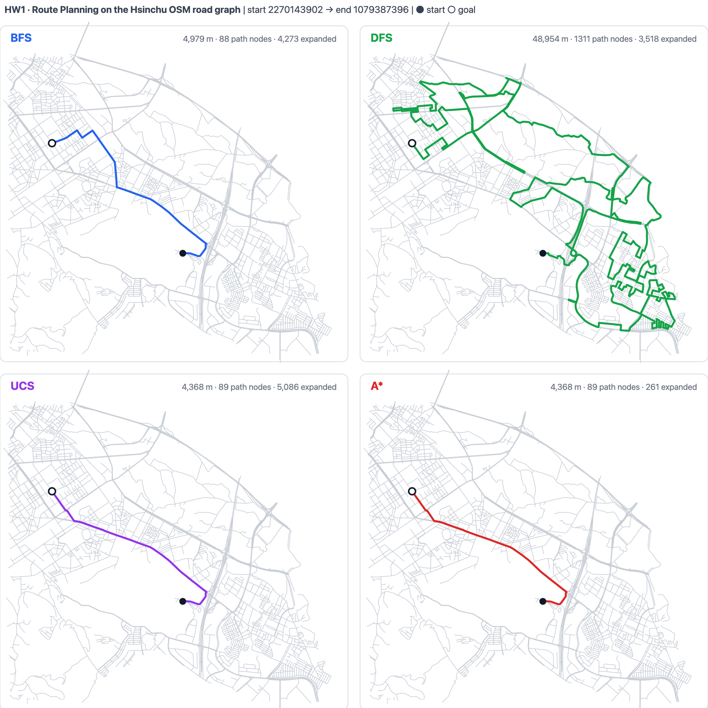

*The four searchers on test case 1, drawn over the real road network. Filled dot = start,
hollow dot = goal. The panels are generated directly from `graph.pkl` and the paths
returned by the scripts in [hw1/](hw1/); a vector version is at
[assets/hw1_routes.svg](assets/hw1_routes.svg).*

### Discussion

1. **BFS is optimal in the wrong metric.** It returns the fewest *hops* (88 vs A\*'s 89)
   but a **14 % longer route** (4,979 m vs 4,368 m), because OSM edges vary in length by
   orders of magnitude. Minimising edge count is simply not the objective.
2. **DFS is pathological on road graphs.** It commits to the first neighbour in each
   adjacency list (the list is pushed onto the stack reversed, so recursion order is
   preserved) and runs until it dead-ends, producing a 1,311-node,
   ~49 km "route" between points 4.4 km apart — an 11× cost blow-up, clearly visible as
   the space-filling green scribble in the figure.
3. **The heuristic pays for itself, but not uniformly.** On case 1 A\* expands 261 nodes
   against UCS's 5,086 — a **19.5× reduction** for an identical path. On case 3 the
   saving collapses to 1.7×, because start and goal sit on opposite sides of the city and
   the straight-line bound stays loose over a long stretch of the search. This is the
   textbook dependence of A\*'s advantage on how tightly $h$ approximates $h^{*}$.
4. **UCS expands more than BFS here** (5,086 vs 4,273 on case 1). That is expected: UCS
   must exhaust every node whose $g$-cost is below the optimal cost, whereas BFS stops at
   the first hop-shallow goal it stumbles on — it just stops at the wrong answer.

The notebook [hw1/main.ipynb](hw1/main.ipynb) renders each of these routes on an
interactive `folium` map. `dfs_recursive.py` was left unimplemented; the iterative
stack version in `dfs_stack.py` is what the notebook imports.

---

## HW2 — Adversarial search for Connect Four

### Problem

Implement and evaluate agents for 6×7 Connect Four: a depth-limited **minimax** searcher,
the same searcher accelerated with **α-β pruning**, and a free-form "strong" agent, all
benchmarked over 100-game matches against a reflex baseline.

### Method

The static evaluator scores a position by counting length-4 windows (horizontal, vertical,
both diagonals) that contain exactly $k$ of a player's discs and no opponent disc:

$$
\text{score} = 10^{10}\,\mathbb{1}[\text{win}_1] + 10^{6} n_3 + 10\, n_2 - 10\, n_2^{opp} - 10^{6} n_3^{opp} - 10^{10}\,\mathbb{1}[\text{win}_2]
$$

The exponential weighting encodes a strict priority ordering — an immediate win outranks
any number of three-in-a-rows, which in turn outranks any number of pairs.

Three agents are built on top of this ([hw2/agents.py](hw2/agents.py)):

- **`agent_minimax`** — full depth-4 tree, ties collected into a set and broken uniformly
  at random (so repeated games are not identical).
- **`agent_alphabeta`** — identical recursion plus the `if beta <= alpha: break` cut-off.
  Same values, fewer nodes.
- **`agent_strong`** — a two-stage design: an α-β pass with an enriched heuristic
  (`get_heuristic_strong`, which adds a **centre-column control bonus** of 6 points per
  disc and an asymmetric penalty of −80 for opponent pairs vs +60 for own pairs, i.e. a
  defensive bias) proposes a candidate set, then each candidate is scored by **15 random
  Monte-Carlo rollouts** to the end of the game and the highest win-rate move is played.

### Results

100-game matches, from the submitted report ([hw2/111705068_hw2/report.pdf](hw2/111705068_hw2/report.pdf)):

| Match-up (P1 vs P2) | P1 wins | P2 wins | Draws | Total wall clock |
|---|---:|---:|---:|---:|
| `agent_minimax` vs `agent_reflex` | **100** | 0 | 0 | 748,906 ms |
| `agent_alphabeta` vs `agent_reflex` | **94** | 6 | 0 | 221,707 ms |
| `agent_alphabeta` vs `agent_strong` | **83** | 17 | 0 | 309,171 ms |

<table>
<tr>
<td width="33%">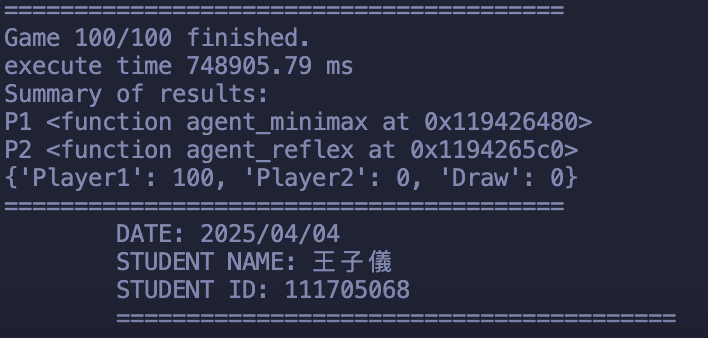</td>
<td width="33%">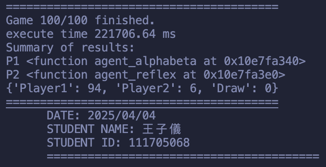</td>
<td width="33%">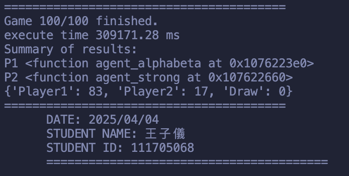</td>
</tr>
<tr>
<td align="center">Minimax · 100–0 · 748.9 s</td>
<td align="center">α-β · 94–6 · 221.7 s</td>
<td align="center">α-β vs strong · 83–17 · 309.2 s</td>
</tr>
</table>

### Discussion

1. **α-β pruning cuts total match time by 3.4×** (748.9 s → 221.7 s) at identical search
   depth. With no move ordering the practical branching factor drops from $b$ to roughly
   $b^{3/4}$; perfect ordering would reach the theoretical $b^{1/2}$.
2. **The 94–6 vs 100–0 gap is not a strength regression.** Both agents return the same
   minimax value; they differ in which *tie* they see, because α-β stops enumerating a
   subtree the moment it is provably irrelevant and therefore builds a smaller `bestMoves`
   set. Random tie-breaking over a smaller set occasionally picks a move that the reflex
   opponent punishes.
3. **`agent_strong` lost, 17–83.** The report states this plainly. The likely mechanical
   cause is visible in the code: the root call is
   `your_function(grid, 4, False, -inf, inf)` — `maximizingPlayer=False`. Since depth 4 is
   even, the leaf's `board.mark` equals the root player's mark, so `get_heuristic_strong`
   is measured from the root player's own perspective while the root node *minimises* over
   it. The Monte-Carlo re-ranking then operates on a candidate set that has already been
   filtered towards the agent's own worst options.

An independent copy of the agents with the Monte-Carlo layer isolated is kept in
[hw2/agents_strong_mc.py](hw2/agents_strong_mc.py). The pygame front-end and match runner
is [hw2/connectFour.py](hw2/connectFour.py).

---

## HW3 — Image classification: CNN vs decision tree

### Problem

Five-way animal classification (elephant, jaguar, lion, parrot, penguin) over **6,834
training images** and **1,710 unlabelled test images**, submitted to a private Kaggle
competition. Two classifiers are required: an end-to-end CNN, and a decision tree written
from scratch (no `sklearn.tree`) over features from a frozen backbone.

Class balance in the training split — note the ~1.8× imbalance between `elephant` and
`jaguar`:

| elephant | jaguar | lion | parrot | penguin | total |
|---:|---:|---:|---:|---:|---:|
| 1,600 | 902 | 1,132 | 1,600 | 1,600 | 6,834 |

### Method

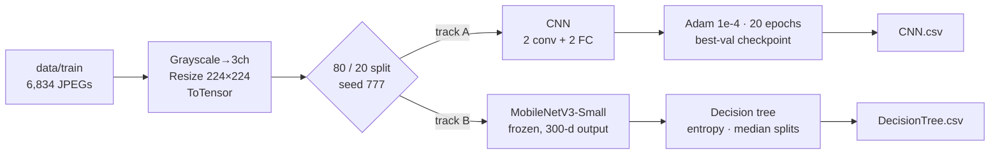

**Track A — CNN** ([hw3/CNN.py](hw3/CNN.py)). Deliberately minimal:
`Conv(3→32,3×3) → ReLU → MaxPool2 → Conv(32→64,3×3) → ReLU → MaxPool2 → FC(64·56·56→256) → FC(256→5)`.
Tensor shapes: `(3,224,224) → (32,224,224) → (32,112,112) → (64,112,112) → (64,56,56) → 256 → 5`.
Trained with Adam (lr = 1e-4) and cross-entropy for 20 epochs, checkpointing on best
validation accuracy. [hw3/finetune.py](hw3/finetune.py) adds a second pass at lr = 1e-5
with early stopping (patience 3) and a switch to freeze everything but the FC head.

**Track B — decision tree** ([hw3/decision_tree.py](hw3/decision_tree.py)). A frozen
`mobilenetv3_small_100` (via `timm`) maps every image to a 300-dimensional vector; the
tree is then grown on those vectors using information gain

$$
IG(y) = H(y) - \frac{|y_L|}{|y|}H(y_L) - \frac{|y_R|}{|y|}H(y_R), \qquad H(y) = -\sum_c p_c \log_2 p_c
$$

with **pre-pruning** on four fronts: `max_depth=16`, `min_samples_split=10`,
`min_samples_leaf=5`, `min_impurity_decrease=1e-7`. The split search is deliberately
cheap — for each of the 300 features only the **median** is tested as a threshold,
turning the usual $O(n \log n)$ per-feature scan into $O(n)$ and the whole split search
into $O(300\,n)$. A post-pruning routine (`prune`) is implemented but left disabled in
[hw3/main.py](hw3/main.py).

### Results

| Model | Metric | Value | Source |
|---|---|---|---|
| CNN (best run) | Kaggle public accuracy | **0.826** | leaderboard screenshot |
| CNN (later submission) | Kaggle public accuracy | 0.813 | leaderboard screenshot |
| Decision tree | validation accuracy | *not recorded in the report* | — |

<table>
<tr>
<td width="52%">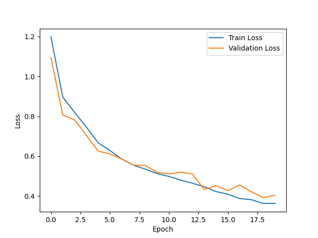</td>
<td width="48%">  
Two graded submissions of <code>CNN.csv</code>. The later run scored <b>lower</b>,
which the report attributes to the small dataset limiting the benefit of further
tuning.</td>
</tr>
<tr><td align="center">Training vs validation loss over 20 epochs.</td><td></td></tr>
</table>

Derived from the two submitted prediction files in this repository (both cover all 1,710
test images):

- **Inter-model agreement: 72.3 %** — the CNN and the decision tree assign the same label
  to 1,236 of 1,710 test images. The remaining 27.7 % is a rough upper bound on how much
  an ensemble of the two could have gained.
- Predicted class distribution is near-uniform for both, with no collapse:
  CNN `{elephant 446, jaguar 238, lion 220, parrot 428, penguin 378}`,
  tree `{411, 233, 290, 389, 387}`.

### Discussion

- The loss curves show train and validation descending **together** for all 20 epochs with
  the gap only opening after ~epoch 13 — the model was still under-trained when the run
  was stopped, not over-fitted. The report names regularisation and dropout as the levers
  to reach for once that gap does open.
- The `max_depth` sweep behaved counter-intuitively: reducing depth from 7 to 5 did *not*
  help, while raising it to 9 did. The report's reading — that depth 7 was not yet in the
  over-fitting regime, so extra capacity was still useful — is consistent with the CNN's
  under-training story on the same data.
- `FC(64·56·56 → 256)` alone accounts for ~51 M of the network's parameters. That single
  layer, not the convolutions, is what makes each checkpoint 196 MB, and is the first
  thing global average pooling would fix.

---

## HW4 — *k*-armed bandits and the exploration/exploitation trade-off

### Problem

Reproduce the canonical 10-armed testbed experiments from Sutton & Barto, Chapter 2,
across three regimes: stationary rewards with sample-average updates, non-stationary
rewards with sample-average updates, and non-stationary rewards with a constant step size.

### Method

**Environment** ([hw4/BanditEnv.py](hw4/BanditEnv.py)). $k=10$ arms; true values
$q_{*}(a) \sim \mathcal{N}(0,1)$ resampled at every `reset()`; a pull returns
$r \sim \mathcal{N}(q_{*}(a), 1)$. In non-stationary mode every arm takes an independent
random walk *before* each pull, $q_{*}(a) \leftarrow q_{*}(a) + \mathcal{N}(0, 0.01)$, so the identity
of the optimal arm drifts over the episode.

**Agent** ([hw4/Agent.py](hw4/Agent.py)). ε-greedy action selection with two update rules
selected by whether `alpha` is supplied:

$$
Q_{t+1}(a) = Q_t(a) + \tfrac{1}{N(a)}\big[r_t - Q_t(a)\big]
\qquad\text{vs}\qquad
Q_{t+1}(a) = Q_t(a) + \alpha\big[r_t - Q_t(a)\big]
$$

The sample average converges to the true mean under stationarity (its $1/N$ weight
decays); the constant-α rule forms an exponentially weighted recency average that never
stops tracking — the whole point when the target is moving.

**Protocol** ([hw4/main.py](hw4/main.py)). 2,000 independent runs averaged per
configuration; 1,000 steps in the stationary experiment and 10,000 in the non-stationary
ones; ε ∈ {0, 0.01, 0.1} crossed with α ∈ {0.1, 0.01, 0.001}. Both average reward and
% optimal action are tracked. Note that in the non-stationary loops the optimal arm is
recomputed **every step**, which is what makes "% optimal action" meaningful under drift.

### Results

**Part 3 — stationary, sample-average**

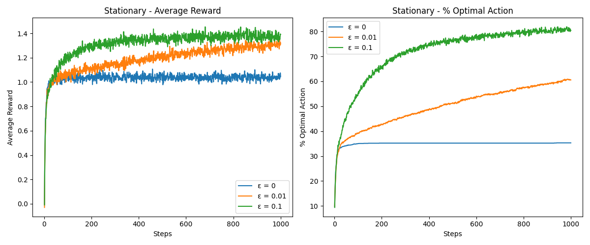

**Part 5 — non-stationary, sample-average**

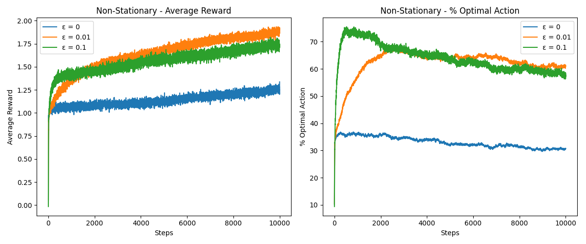

**Part 7 — non-stationary, constant step size (9 configurations)**

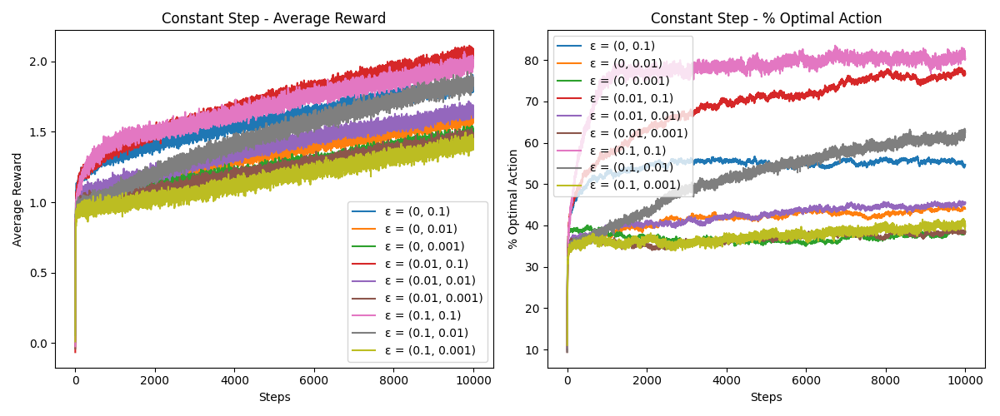

### Discussion

- **Greedy (ε = 0) plateaus at ~35 % optimal actions after roughly 100 steps** and never
  moves again, even in the stationary world. With $Q$ initialised to zero and a single
  unlucky first sample, an arm can be written off permanently — there is no mechanism left
  to revisit it. ε = 0.01 is still climbing (61 %) when the budget runs out at 1,000 steps;
  ε = 0.1 has already saturated near 81 %.
- **Under drift, sample-average updates fail structurally, not just slowly.** The $1/N$
  weight makes the agent progressively *more* confident in estimates that are becoming
  progressively *more* stale. ε = 0 "fails completely, getting stuck with outdated
  knowledge" (report).
- **The best configuration is ε = 0.1 with α = 0.1**: highest average reward and ~80 %
  optimal actions at 10,000 steps, versus ~40 % for α = 0.001 at the same ε. Exploration
  and recency-weighting are complementary — exploration keeps generating fresh evidence,
  and a large α is what lets that evidence actually overwrite the old estimate.
- The α = 0.001 curves are almost indistinguishable from each other across all ε values,
  which is the clearest possible demonstration that a step size too small to track drift
  makes the exploration rate irrelevant.

Unit tests for each part: [testBanditEnv.py](hw4/testBanditEnv.py),
[testAgent.py](hw4/testAgent.py), [testNon.py](hw4/testNon.py),
[testConstant.py](hw4/testConstant.py).

---

## HW5 — Diffusion models: generation and multi-view illusions

### Part 1 — Anime face generation with a DDPM

**Notebook:** [hw5/diffusion.ipynb](hw5/diffusion.ipynb)

A U-Net denoiser is trained from scratch on a 64×64 anime-face dataset. The forward
process adds Gaussian noise on a fixed schedule,

$$
q(x_t \mid x_0) = \mathcal{N}\!\left(x_t;\ \sqrt{\bar\alpha_t}\,x_0,\ (1-\bar\alpha_t)\mathbf{I}\right)
$$

and the network is trained to invert one step at a time, so that sampling walks pure noise
back to an image.

Final hyper-parameters (after the tuning described below):

| Parameter | Value | | Parameter | Value |
|---|---|---|---|---|
| image size | 64×64 | | base channels | **64** |
| batch size | 64 | | `dim_mults` | **(1, 2, 4, 8)** |
| train steps | 20,000 | | diffusion timesteps | 1,000 |
| learning rate | 1e-4 | | sampling timesteps | 20 |
| EMA decay | 0.999 | | β schedule | **cosine** |
| seed | 114514 | | | |

<table>
<tr><td>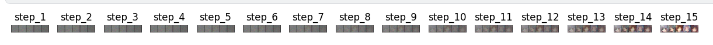</td></tr>
<tr><td align="center">Reverse process, steps 1–15: structure emerges from noise only in the last third of the trajectory.</td></tr>
<tr><td align="center">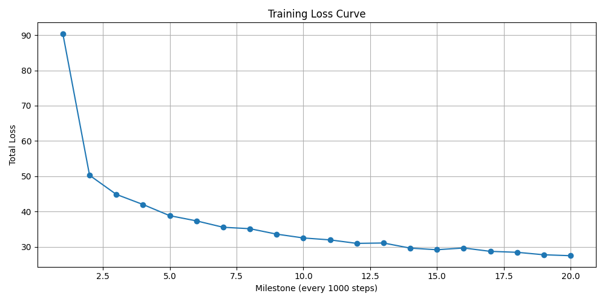</td></tr>
<tr><td align="center">Total loss per 1,000-step milestone: 90.3 → 27.5 over 20,000 steps, with the knee at milestone 5.</td></tr>
</table>

**Ablation findings** (from the report):

- **Too few sampling steps (10–20) over-smooth.** Faces lose hair texture and eye
  sharpness — the sampler's step size is too coarse to resolve high-frequency detail.
- **`channels = 32` produces checkerboard artifacts.** Raising base width to 64 and
  extending `dim_mults` to `(1,2,4,8)` was "critical in reducing artifacts and
  over-smoothing" — capacity, not schedule, was the binding constraint.
- **Cosine β schedule + EMA significantly improved stability.** The cosine schedule spends
  less of the trajectory in the near-pure-noise regime, where the linear schedule wastes
  capacity.

### Part 2 — Optical illusions with multi-view diffusion

**Notebook:** [hw5/multi-view.ipynb](hw5/multi-view.ipynb)

A single image is generated that reads as **one subject upright and a different subject
rotated 180°**. DeepFloyd IF is a **pixel-space** (not latent) diffusion model, so the
transforms act on the image itself. The mechanism: at every denoising step, the noisy
image is pushed through each view transform $v_i$, the frozen U-Net predicts noise on that
view's own prompt, each prediction is mapped back through $v_i^{-1}$, and the results are
averaged before the scheduler step:

$$
\hat\epsilon_t = \frac{1}{N}\sum_{i=1}^{N} v_i^{-1}\!\left(\epsilon_\theta\!\left(v_i(x_t),\, t,\, c_i\right)\right)
$$

This requires the view transforms to be **linear, invertible and orthogonal**, so that
averaging in transformed space remains a valid noise estimate. Here
$v_1 = \mathrm{Identity}$ and $v_2 = \mathrm{hflip} \circ \mathrm{vflip}$ (a 180° rotation,
which is its own inverse).

```mermaid
flowchart LR
  X["x_t"] --> V1["view 1 (identity)"] --> U1["UNet &#183; 'painting of a crow'"] --> I1["inverse view 1"]
  X --> V2["view 2 (rotate 180)"] --> U2["UNet &#183; 'painting of a black cat'"] --> I2["inverse view 2"]
  I1 --> AVG["average ε̂"]
  I2 --> AVG
  AVG --> S["scheduler.step → x_(t-1)"]
```

Pipeline: DeepFloyd IF stage-I (64×64, multi-view) → stage-II (256×256, multi-view) →
Stable Diffusion ×4 upscaler (1024×1024, single-prompt). Classifier-free guidance scale
15.0, 30 inference steps per stage.

**Result** — prompts `"painting of a crow"` / `"painting of a black cat"`:

<table>
<tr>
<td width="50%">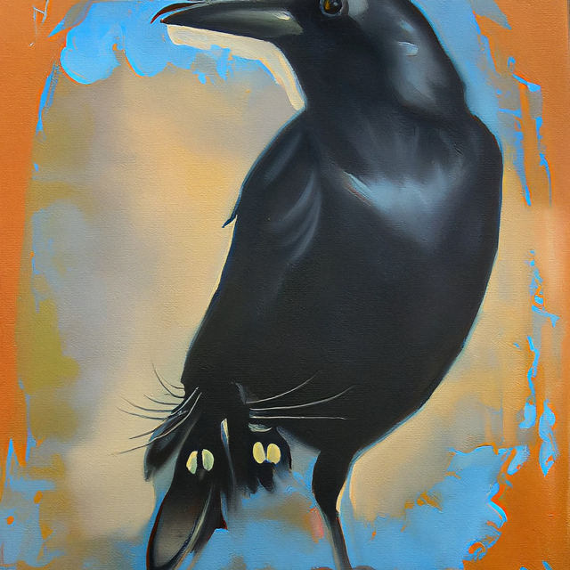</td>
<td width="50%">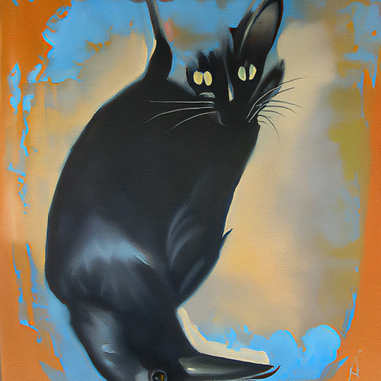</td>
</tr>
<tr>
<td align="center"><b>Upright</b> — <i>painting of a crow</i> · CLIP score <b>0.3320</b></td>
<td align="center"><b>Rotated 180°</b> — <i>painting of a black cat</i> · CLIP score <b>0.3315</b></td>
</tr>
</table>

The two CLIP scores are **within 0.0005 of each other**, which is the quantitative
statement that neither prompt was sacrificed for the other — the illusion is balanced, not
a crow with a faint cat hallucinated into it.

**Prompt-design finding.** The report states the strategy explicitly: *"I believe two
prompts must be similar to get better performance, I pick crow and blackcat. In order to
make it in the same style, I constraint a painting style."* Two subjects that already
agree in silhouette, palette and rendering style leave the averaged noise estimate a
solution that satisfies both. The report also includes an unlabelled failure case:

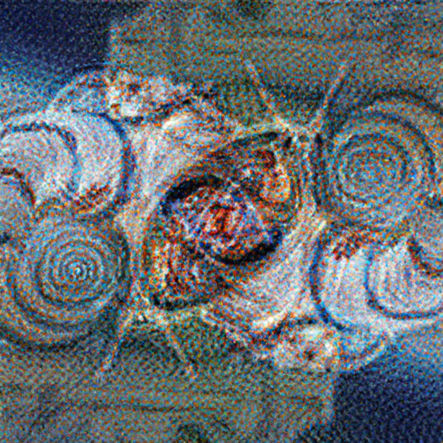

Failure case from the report (prompts not recorded). The sample never resolves into a
subject under either view — the sampler converges to high-frequency texture, the visual
signature of two view-conditioned noise estimates pulling in incompatible directions.

---

## Final project — Street-tree detection over Taipei satellite imagery

> Team project · local copy in [final_project/](final_project/)

### Problem

Detect **individual street trees** in high-resolution RGB satellite imagery of Taipei City
and turn the detections into a per-image **green-coverage** statistic. Urban canopy is the
hard case for tree detection: crowns are small, frequently occluded by buildings, shadowed
by adjacent structures, and clustered into rows rather than the open stands that
forestry-oriented datasets contain.

### Data pipeline

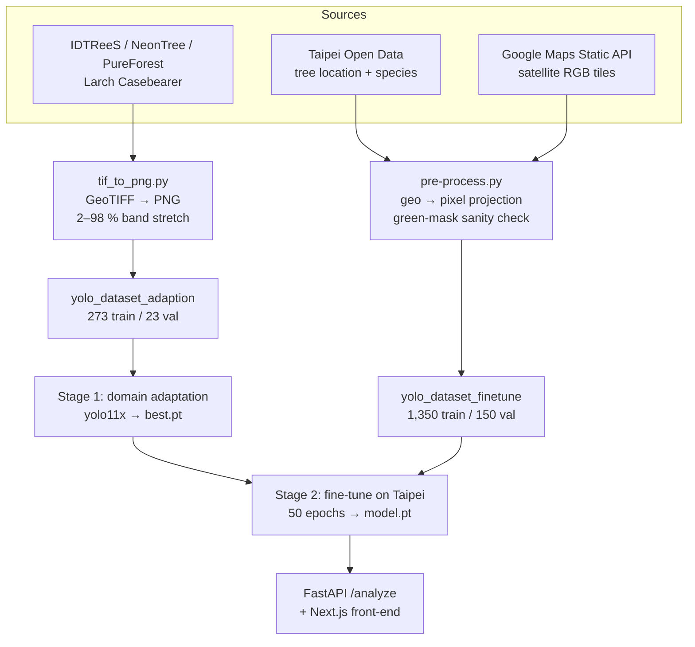

The georeferencing step in
[source_datasets_finetuning/pre-process.py](final_project/source_datasets_finetuning/pre-process.py)
is what makes the labels possible: each 640×640 tile is named by its centre latitude and
longitude, a fixed offset (±0.00288° lat, ±0.003198° lon) defines its bounds, and each
open-data tree record inside those bounds is projected to a pixel coordinate. A local
green-pixel check (`has_green_area`) then filters out records whose mapped location shows
no vegetation — an automatic guard against stale or mis-surveyed civic records.

### Model

**Two-stage transfer**, both stages in [train.py](final_project/train.py):

1. **Domain adaptation** — `yolo11x.pt` (COCO) fine-tuned on aerial forestry imagery
   (IDTReeS / NeonTree), 273 train / 23 val images, teaching the detector what a tree crown
   looks like from above.
2. **Target fine-tuning** — that checkpoint (`best.pt`) fine-tuned on 1,350 Taipei tiles
   (150 val) for 50 epochs at 640 px.

Training configuration reflects the small-dense-object regime: **mosaic augmentation
disabled** (`mosaic=0.0` — mosaic's tiling would fragment already-tiny crowns), modest
geometric jitter (±3° rotation, 2 % translate, 0.2 scale), mild perspective (0.0005),
vertical flip 0.2 / horizontal 0.3 (aerial imagery has no canonical "up"), plus
`copy_paste=0.08`, `mixup=0.04`, `erasing=0.08`, cosine LR, AMP, multi-scale, dropout 0.05,
NMS IoU 0.7, seed 42.

### Deployment

`green-coverage/` is a Next.js + Tailwind front-end over a FastAPI service. `POST /upload`
stores an image, `POST /analyze` runs YOLO inference
([api/model_inference.py](final_project/green-coverage/api/model_inference.py)) and returns
the annotated image plus

$$
\text{coverage} = 100 \times \frac{\sum_{b \in \text{boxes}} (x_2-x_1)(y_2-y_1)}{H \times W}
$$

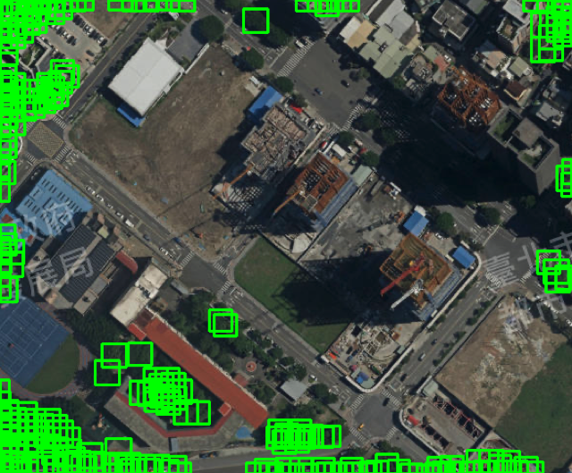

Live output of the deployed detector on a Taipei tile. Each green box is one detected
crown; their summed area over the image area is the reported coverage.

**Caveat, stated plainly:** the inference endpoint runs at `conf=0.01`, two orders of
magnitude below the training-time threshold of 0.5, and the coverage metric sums **raw
box areas without de-duplication**. Overlapping boxes are therefore double-counted and the
figure above visibly contains stacked detections. The number is a usable *relative*
indicator across images processed the same way, not a calibrated canopy-cover percentage.

Pre-processed datasets are published at
[huggingface.co/datasets/zbyzby/TaipeiTrees](https://huggingface.co/datasets/zbyzby/TaipeiTrees/tree/main).
